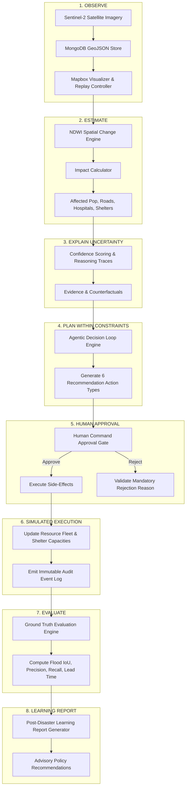

# Architecture Diagrams

## 1. End-to-End 8-Stage Decision Loop



## 2. System Architecture Component Diagram

```mermaid
componentDiagram
    [React + Mapbox Dashboard] --> [Express REST API Layer]
    [Express REST API Layer] --> [Replay Engine]
    [Express REST API Layer] --> [Flood Intelligence Engine]
    [Express REST API Layer] --> [Impact Assessment Engine]
    [Express REST API Layer] --> [Evacuation Routing Engine]
    [Express REST API Layer] --> [Agentic Planner Loop Engine]
    [Express REST API Layer] --> [Human Approval & Audit Service]
    [Express REST API Layer] --> [Failure Simulator & Degraded Estimator]
    [Express REST API Layer] --> [Evaluation & Learning Loop Engine]
    
    [Express REST API Layer] --> [MongoDB Atlas / 2dsphere Store]
```
