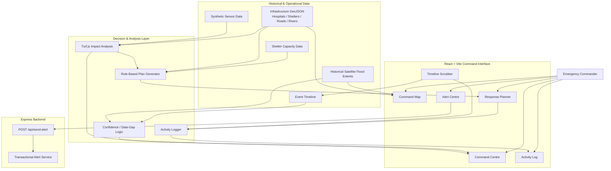
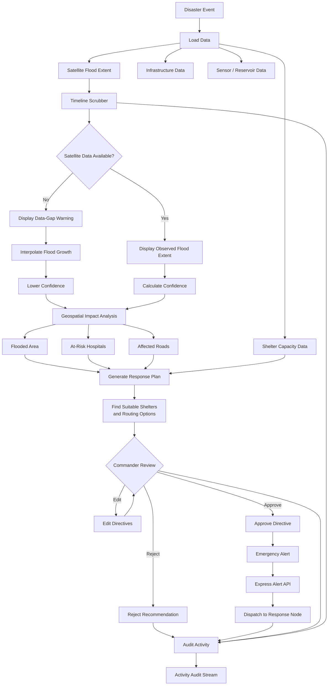
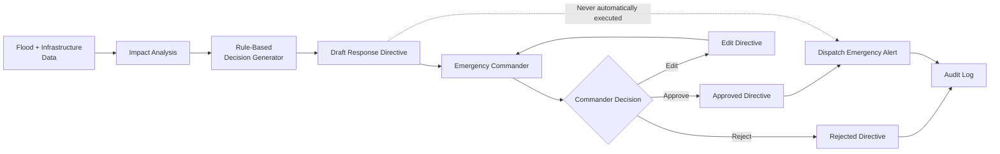
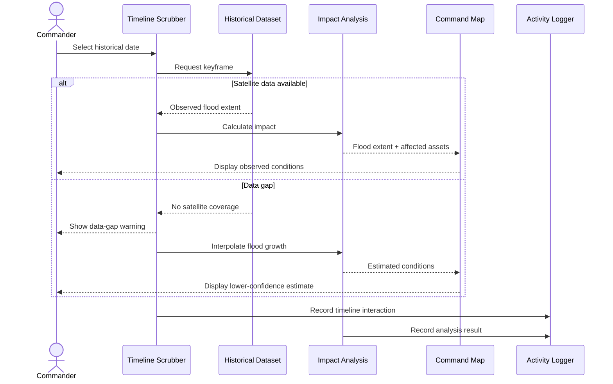

🏆 HACKATHON ACHIEVEMENT

🥈 1ST RUNNER-UP — CODERUSH 2.0

Team Apex ! proudly secured the 🥈 1st Runner-Up position at CodeRush 2.0, organized by Yeshwantrao Chavan College of Engineering (YCCE), Nagpur.

Project Name - Suraksha Setu

Team Name - Team Apex! 

Team Leader - Aditya Singh

🚨 ABOUT SURAKSHA SETU

Suraksha Setu is a Disaster Management & Response Platform designed to help authorities efficiently issue emergency alerts, coordinate evacuations, manage disaster response, and support affected communities during recovery and rehabilitation.

The project focuses on building a faster, safer, and more coordinated disaster-response ecosystem, bridging the gap between authorities and citizens during critical situations.

## 🌟 Key Features

1. **Real-Time Detection & Hazard Tracking**
   - Interactive horizontal scrubber driven by satellite keyframes (capturing event onset, data gaps, and peak hazard footprints).
   - Dynamic **Confidence Indicators** (numeric 0.0–1.0 and visual tags).
   - **Data-Gap Banner Warning** explicitly alerting users when satellite coverage is unavailable and models interpolate growth.

2. **Evacuation Planning & Decision Support (Human-in-the-Loop)**
   - Rule-based decision generator (`src/lib/planGenerator.js`) calculating nearest safe relief shelters with available capacity and routing vectors.
   - **Human-in-the-Loop Framework**: Action cards require explicit commander review with **Approve**, **Edit Directives**, or **Reject** choices. Unapproved recommendations remain strictly labeled as draft directives.

3. **Geospatial Impact Analysis (Turf.js)**
   - Calculates flooded surface area in hectares.
   - Identifies at-risk hospitals and submerged road networks.

4. **Activity Audit Stream**
   - Timestamped log capturing satellite timeline scrubbing, plan generation, human approval actions, and emergency alert dispatches.

5. **Emergency Alert Center**
   - Minimal Express backend endpoint (`POST /api/send-alert`) for transmitting emergency transactional alerts to district response command nodes.

---

## 📊 Data Provenance & Credits

- **Satellite Flood Extents**: Dartmouth Flood Observatory (DFO) / Sentinel-1 SAR observations.
- **Infrastructure (Hospitals, Shelters, Roads, Rivers)**: Sourced from [OpenStreetMap](https://www.openstreetmap.org/) via Overpass API under the Open Database License (ODbL).
- **Operational Datasets**: Reservoir levels (`sensor_log.json`) and shelter capacity limits (`shelters_capacity.json`) are integrated data feeds for live operational deployment.

---

## 🛠️ Tech Stack

- **Frontend**: React (v18), Vite, Tailwind CSS, Lucide Icons, Recharts
- **Geospatial & Mapping**: Leaflet, `react-leaflet`, `@turf/turf`
- **Backend**: Node.js, Express, Nodemailer

---

## 🚀 Quickstart & Installation

### 1. Install Dependencies
```bash
npm install
```

### 2. Start Project (Frontend + Express Backend)
```bash
npm run dev:all
```
- **Frontend App**: `http://localhost:5173`
- **Express Backend API**: `http://localhost:3001`

### 3. Build Production Bundle
```bash
npm run build
```

### 4. Deploy to Vercel + Render
See [DEPLOYMENT.md](DEPLOYMENT.md) for the full hosting walkthrough.

---

## 🏗️ System Architecture



---

## 🔄 End-to-End Disaster Response Workflow



---

## 👤 Human-in-the-Loop Decision Workflow



---

## 📡 Hazard Replay



## 📁 Directory Structure

```
.
├── public/data/
│   ├── hospitals.geojson          # Named hospitals in Alappuzha/Kottayam
│   ├── shelters.geojson           # Schools & community centres
│   ├── roads.geojson              # Highway & secondary road network
│   ├── rivers.geojson             # Waterways & river vectors
│   ├── flood_20180814.geojson     # Aug 14 satellite flood extent
│   ├── flood_20180817.geojson     # Aug 17 peak flood extent
│   ├── event_timeline.json        # Keyframe scrubber dataset
│   ├── sensor_log.json            # Hydro gauge & dam capacity feed
│   └── shelters_capacity.json     # Capacity metrics & facility specs
├── src/
│   ├── components/
│   │   ├── ActivityFeedItem.jsx
│   │   ├── AlertComposer.jsx
│   │   ├── ConfidenceBadge.jsx
│   │   ├── DataGapBanner.jsx
│   │   ├── LayerToggle.jsx
│   │   ├── MapView.jsx
│   │   ├── Navbar.jsx
│   │   ├── PlanCard.jsx
│   │   └── TimelineScrubber.jsx
│   ├── lib/
│   │   ├── activityLogger.js      # Shared audit logger context & hook
│   │   ├── impactEstimate.js      # Turf.js spatial analysis
│   │   └── planGenerator.js       # Decision support algorithm
│   ├── pages/
│   │   ├── ActivityLog.jsx
│   │   ├── AlertCentre.jsx
│   │   ├── CommandCentre.jsx
│   │   ├── CommandMap.jsx
│   │   └── ResponsePlanner.jsx
│   ├── state/
│   │   └── AppContext.jsx          # Global application state
│   ├── App.jsx
│   ├── main.jsx
│   └── index.css
├── server/
│   ├── index.js                   # Express server entry point
│   ├── routes/sendAlert.js        # POST /api/send-alert handler
│   └── .env.example
├── package.json
└── README.md
```
