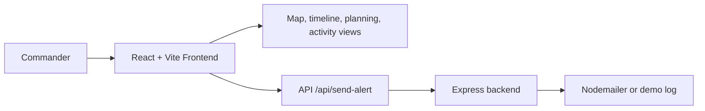
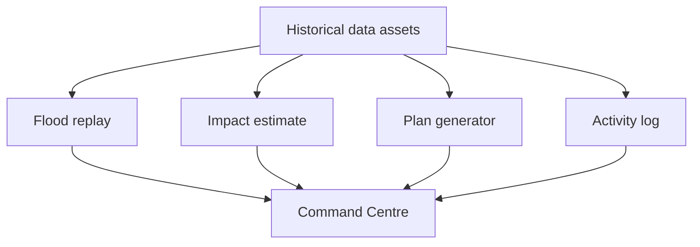

# Disaster Management Command System

> Historical simulation and replay tool based on the Kerala Floods of August 2018. This is not a live monitoring system.

## Overview

The app combines a React + Leaflet command center with a small Express API for alert dispatch. It focuses on flood replay, impact assessment, planning, and audit logging.

## Architecture





## What it does

- Replays flood progression with timeline scrubbing and confidence indicators.
- Estimates impact using Turf.js and map layers for roads, rivers, shelters, and hospitals.
- Generates evacuation guidance with human approval before action.
- Sends emergency alerts through a minimal Express endpoint.

## Tech Stack

- Frontend: React, Vite, Tailwind CSS, Leaflet, Recharts
- Spatial analysis: `@turf/turf`, `react-leaflet`
- Backend: Node.js, Express, Nodemailer

## Quickstart

```bash
npm install
npm run dev:all
```

- Frontend: `http://localhost:5173`
- Backend: `http://localhost:3001`

```bash
npm run build
```

## Data Notes

Flood extents and infrastructure layers are based on historical Kerala 2018 data; reservoir and shelter capacity fixtures are synthetic demo inputs.